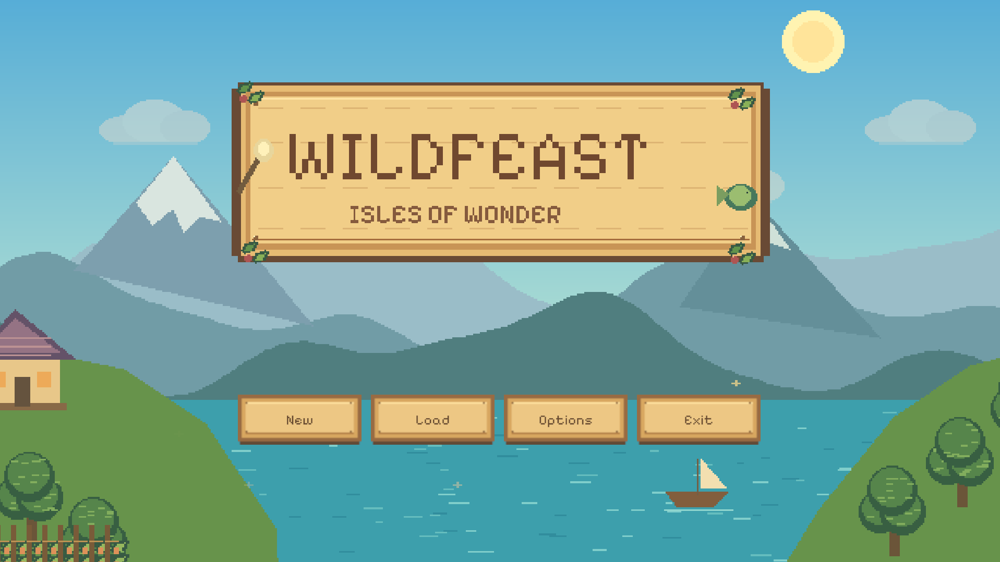
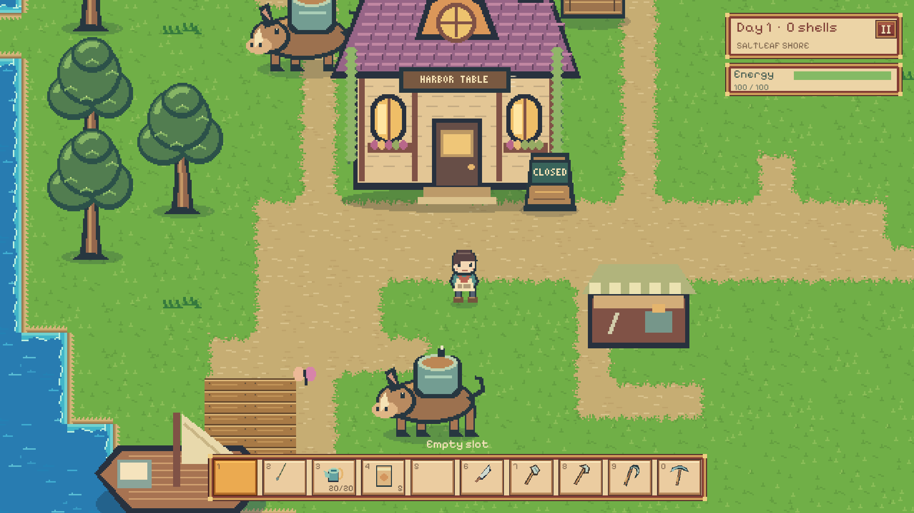
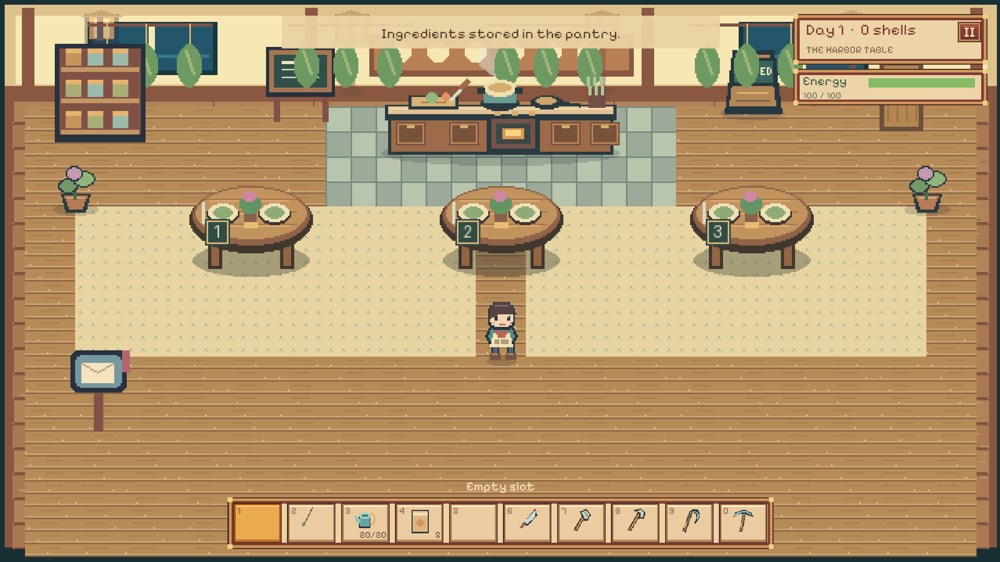

# Wildfeast: Isles of Wonder

I've wanted to make a game like this for a long time: explore a strange food world, bring home whatever you find, and turn a tiny restaurant into somewhere people love to eat.

I'm taking inspiration from **Toriko**, **Dave the Diver**, and **Stardew Valley**. Toriko especially stuck with me as a kid. A whole world of animals and plants that become food you could never find in real life? I want to explore that.

So that's Wildfeast. A cozy pixel-art adventure where dinner might be swimming in a pond, growing in the ground, or about to charge at you.

## Out looking for dinner

Fish, forage, grow weird crops, and meet creatures with ingredients worth bringing home. Explore towns and islands, meet the people who live there, and see what ends up on tomorrow's menu.

Yes, I want cabbage-looking fish. Yes, some animals carry soup on their backs. This world gets to be weird.

## Back at the restaurant

Bring your haul home, cook it, serve your guests, and use the earnings to make the place a little better. Then sleep, wake up, and go looking for something new.

**Explore → gather → cook → serve → grow.** That's the loop I'm building around.

## Still cooking

This is a work in progress. Fishing, farming, cooking, restaurant service, character customization, and exploration are playable, and I'm still working on the art, maps, creatures, and all the little things that make a world feel alive.

I'm making it for **Windows**, **offline and single-player**, and I want it to be **free, with no ads or purchases**.

Thanks for having a look. I've got a lot more strange food to put in this world.
